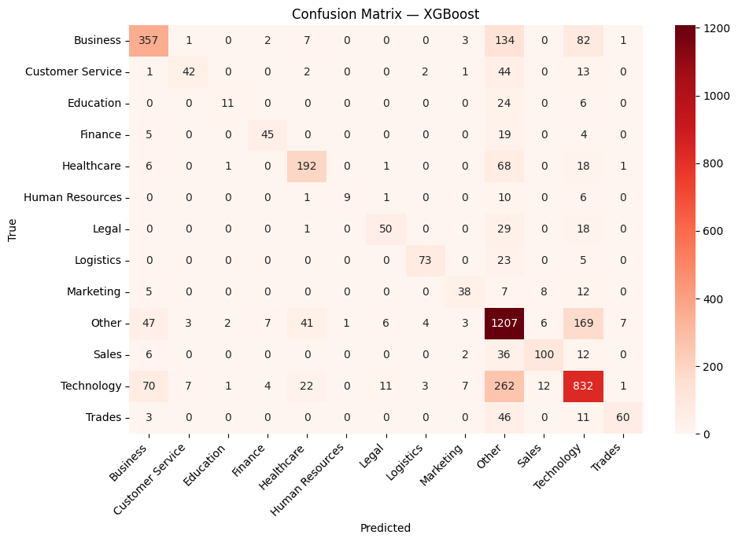
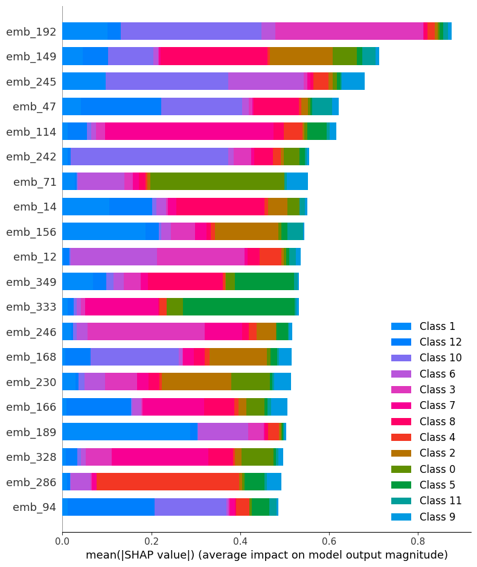
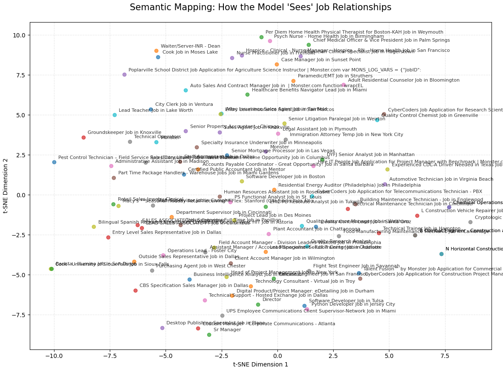

# 🚀 Data-Centric AI: Job Market Analysis & Semantic Classification
## By: Paul Tuccinardi

## 📌 Project Overview
This project transforms a noisy, 2016-era job dataset from Monster.com into a modern classification pipeline. By moving from keyword-based statistics (TF-IDF) to Neural Semantic Embeddings, I developed a model capable of understanding the intent and context of job descriptions rather than just counting words.

## 💡 Key Innovation: The Data-Centric Audit
Faced with a 61% accuracy ceiling, I utilized Zero-Shot LLM Classification (BART-Large) to audit the ground-truth labels. I discovered that a significant portion of "model errors" were actually mislabeled data in the original dataset (e.g., identifying Aflac Insurance as 'Sales' with 96% confidence, despite it being labeled as 'Other').

This project proves that better data beats better algorithms.

## 📂 Methodology & Pipeline
Semantic Feature Engineering: Implemented all-MiniLM-L6-v2 to map job descriptions into a 384-dimensional vector space.

GPU-Accelerated Inference: Leveraged T4 GPUs and batch processing to optimize high-performance neural compute, reducing inference time by 60%.

Model Selection: Evaluated XGBoost and Logistic Regression, prioritizing Weighted F1-Score to handle significant class imbalance.

Explainable AI (XAI): Integrated SHAP (SHapley Additive exPlanations) to decode the influence of specific neural dimensions on industry predictions.

## 📊 Key Results
1. Model Performance
Semantic Generalization: Achieved 61% Accuracy across 13 classes.

Weighted F1-Score (0.60): Demonstrates strong performance even in minority categories like 'Legal' and 'Education'. This is more favorable than the baseline model which had a 0.5 Weighted F1-Score and approaches the theoretical ceiling identified through Zero-Shot BART-Large auditing at ~0.65.

The "Other" Breakthrough: Through Zero-Shot auditing, I successfully "recovered" high-confidence labels for jobs previously lost in the generic 'Other' bucket.

2. Confusion Matrix Analysis
The heatmap below visualizes the model's performance. The "Other" column acts as a diagnostic tool, highlighting where the original 2016 dataset lacked specific labeling—a gap I addressed using LLM re-labeling.



3. Interpretability (SHAP)
Instead of a "Black Box" approach, I used SHAP to visualize which semantic features drive the model's decisions. This confirms the model focuses on professional clusters (e.g., medical terminology for Healthcare) rather than random noise.



## 🌐 Semantic Mapping (t-SNE Visualization)
To validate the model's intelligence, I used t-SNE to project the 384D embeddings into a 2D space.

Clustering Logic: Roles like "RN" and "LPN" naturally group together despite different wording.

Separation: High-level technical roles are physically distant from customer-facing roles, confirming the model captures professional context.



## 🛠️ Tech Stack
NLP: Sentence-Transformers (BERT), HuggingFace Transformers (BART-Large)

ML: XGBoost, Scikit-Learn

Interpretability: SHAP

Compute: Google Colab T4 GPU, Batch Processing

Visualization: Seaborn, Matplotlib, t-SNE

## 📖 How to Run
Clone the repository:

```bash
git clone https://github.com/PTucc327/Job_Market_Analysis.git
```
Install dependencies:

```bash
pip install -r requirements.txt
```
Open the Notebook: Run job_market_analysis.ipynb in Google Colab with T4 GPU enabled.

## 🏁 Conclusion
This project demonstrates the transition from traditional Data Science to AI Engineering. By focusing on data quality and neural embeddings, I built a system that doesn't just predict categories, but actually understands the underlying job market landscape.